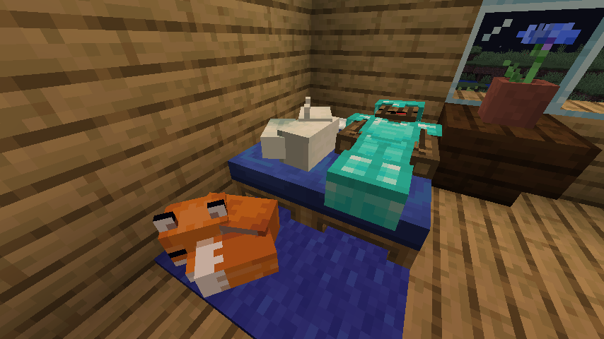
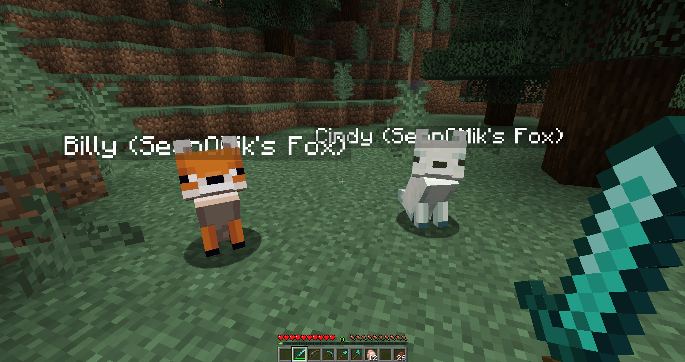
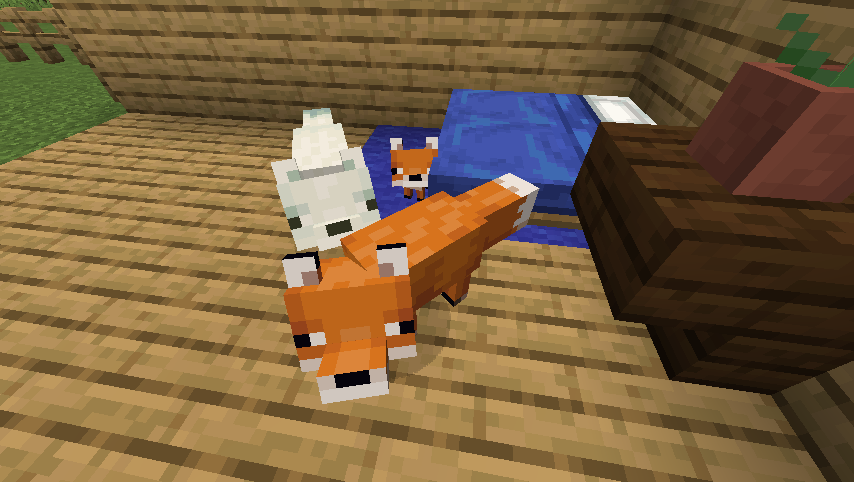
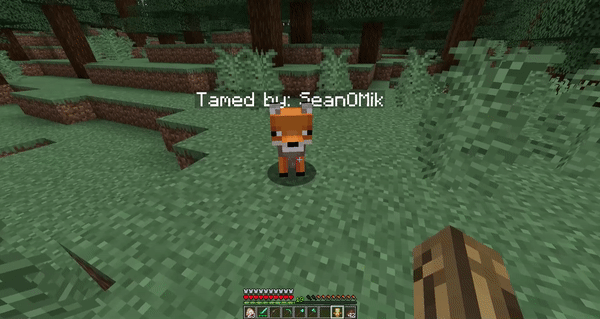
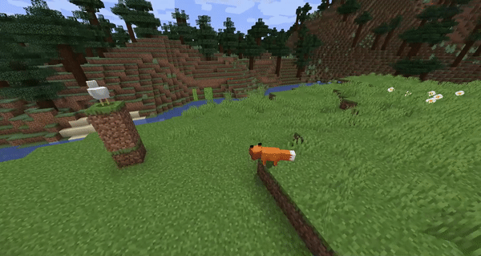

<h1 align="center">Tamable Foxes</h1>

SpigotMC Plugin that gives you the ability to tame foxes!

### WARNING: Do not reload the plugin, you may loose foxes!!
#### NOTE: You no longer need to add the program arguments to your start file. If you previously had them, you can delete them, but I don't think it would harm if you leave them in.

### Default configuration files:
* <a href="https://github.com/SeanOMik/TamableFoxes/blob/master/Plugin/src/main/resources/config.yml">config.yml</a>
* <a href="https://github.com/SeanOMik/TamableFoxes/blob/master/Plugin/src/main/resources/language.yml">language.yml</a>
 

If you get any errors, <a href="https://github.com/SeanOMik/TamableFoxes/issues/new">create an issue!</a>  

Have you ever wanted to tame foxes? Well, now you can! <b>Use chicken to tame</b> and sweet berries to breed them!  

## Features:
* 33% Chance of taming
* Breeding
* Wild foxes pick berry bushes
* Leaping on targets
* Tamed foxes sleep when their owner does
* Foxes follow owner
* You can shift + right-click to let the fox hold items
* Right-click to make the fox sit
* Shift Right-click with an empty hand to make the fox sleep
* If the fox is holding a totem of undying, the fox will consume it and be reborn.
* Foxes attack the owner's target
* Foxes attack the thing that attacked the owner.
* Foxes are automatically spawned inside the world. (Same areas as vanilla foxes)
* Foxes attack chickens and rabbits.
* Snow and red foxes.
* Language.yml
* Message for when a tamed fox dies
* Disabling certain gameplay messages
  * Open `language.yml`. These are the messages that be disabled by changing the text to "disabled"
    * `taming-tamed-message`
    * `taming-asking-for-name-message`
    * `taming-chosen-name-perfect`
    * `fox-doesnt-trust`

## Commands:
* /spawntamablefox [red/snow]: Spawns a tamable fox at the players' location.

## Permissions:
* tamablefoxes.spawn: Gives permission to run the command /spawntamablefox. Default: `op`
* tamablefoxes.tame: Gives the player the ability to tame a fox. Default: `Everybody`
* tamablefoxes.tame.unlimited: Lets players bypass the tame limit. Default: `op`

 

## Metrics collection

Tamable Foxes collects anonymous server statistics through bStats, an open-source statistics service for Minecraft software. If you wish to opt-out, you can do so in the `bstats/config.yml` file.
